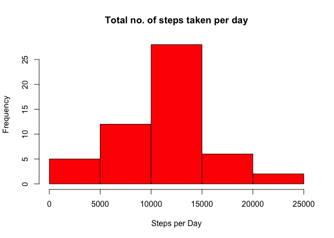
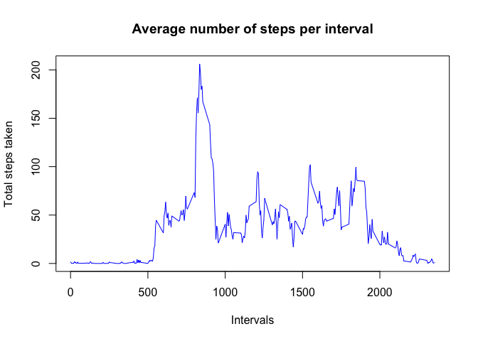
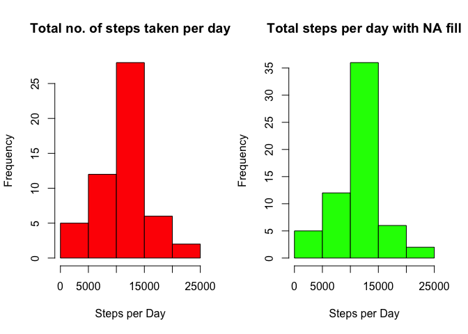
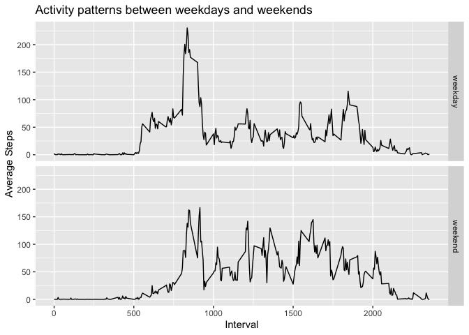

# Loading Packages


```r
library(readr)
library(dplyr)
```

```
## 
## Attaching package: 'dplyr'
```

```
## The following objects are masked from 'package:stats':
## 
##     filter, lag
```

```
## The following objects are masked from 'package:base':
## 
##     intersect, setdiff, setequal, union
```

```r
library(ggplot2)
library(lubridate)
```

```
## 
## Attaching package: 'lubridate'
```

```
## The following object is masked from 'package:base':
## 
##     date
```
##  Loading and preprocessing the data

```r
unzip("activity.zip")
activitydata<-read.csv("activity.csv")
str(activitydata) # take a general overview of the data
```

```
## 'data.frame':	17568 obs. of  3 variables:
##  $ steps   : int  NA NA NA NA NA NA NA NA NA NA ...
##  $ date    : Factor w/ 61 levels "2012-10-01","2012-10-02",..: 1 1 1 1 1 1 1 1 1 1 ...
##  $ interval: int  0 5 10 15 20 25 30 35 40 45 ...
```

```r
summary(activitydata)
```

```
##      steps                date          interval     
##  Min.   :  0.00   2012-10-01:  288   Min.   :   0.0  
##  1st Qu.:  0.00   2012-10-02:  288   1st Qu.: 588.8  
##  Median :  0.00   2012-10-03:  288   Median :1177.5  
##  Mean   : 37.38   2012-10-04:  288   Mean   :1177.5  
##  3rd Qu.: 12.00   2012-10-05:  288   3rd Qu.:1766.2  
##  Max.   :806.00   2012-10-06:  288   Max.   :2355.0  
##  NA's   :2304     (Other)   :15840
```
## Addressing Part1: What is mean total number of steps taken per day?

```r
# 1.Calculate the total number of steps taken per day
stepsperday<-aggregate(steps~ date,data=activitydata, FUN = sum,na.rm=TRUE)
str(stepsperday) # take a general overview of the data
```

```
## 'data.frame':	53 obs. of  2 variables:
##  $ date : Factor w/ 61 levels "2012-10-01","2012-10-02",..: 2 3 4 5 6 7 9 10 11 12 ...
##  $ steps: int  126 11352 12116 13294 15420 11015 12811 9900 10304 17382 ...
```

```r
#2. Plot histogram for steps per Day
hist(stepsperday$steps, xlab = "Steps per Day", main= "Total no. of steps taken per day",col="red")
```

<!-- -->


```r
#3.Calculate and report the mean and median total number of steps taken per day
summary(stepsperday)# this also mention mean and median steps taken per Day
```

```
##          date        steps      
##  2012-10-02: 1   Min.   :   41  
##  2012-10-03: 1   1st Qu.: 8841  
##  2012-10-04: 1   Median :10765  
##  2012-10-05: 1   Mean   :10766  
##  2012-10-06: 1   3rd Qu.:13294  
##  2012-10-07: 1   Max.   :21194  
##  (Other)   :47
```

```r
spdmean<-mean(stepsperday$steps, na.rm=TRUE) 
spdmean # mean steps per Day
```

```
## [1] 10766.19
```

```r
spdmedian<-median(stepsperday$steps, na.rm=TRUE) 
spdmedian# median steps per Day
```

```
## [1] 10765
```
## Addressing Part2: What is the average daily activity pattern?
1. Make a time series plot (i.e. \color{red}{\verb|type = "l"|}type="l") of the 5-minute interval (x-axis) and the average number of steps taken, averaged across all days (y-axis)

```r
# first create subset for average steps taken, averaged across all days
stepsperinterval<-aggregate(steps~interval,data=activitydata,FUN=mean,na.rm=TRUE)
str(stepsperinterval)
```

```
## 'data.frame':	288 obs. of  2 variables:
##  $ interval: int  0 5 10 15 20 25 30 35 40 45 ...
##  $ steps   : num  1.717 0.3396 0.1321 0.1509 0.0755 ...
```

```r
summary(stepsperinterval)
```

```
##     interval          steps        
##  Min.   :   0.0   Min.   :  0.000  
##  1st Qu.: 588.8   1st Qu.:  2.486  
##  Median :1177.5   Median : 34.113  
##  Mean   :1177.5   Mean   : 37.383  
##  3rd Qu.:1766.2   3rd Qu.: 52.835  
##  Max.   :2355.0   Max.   :206.170
```
2.Plot of the 5-minute interval (x-axis) and the average number of steps taken, averaged across all days (y-axis)

```r
#line Plot for steps per 5min-interval
plot(stepsperinterval$interval, stepsperinterval$steps, type = "l", col = "blue", xlab = "Intervals",
     ylab = "Total steps taken", main = "Average number of steps per interval")
```

<!-- -->

3.Which 5-minute interval, on average across all the days in the dataset, contains the maximum number of steps?

```r
max_stepsperinterval<-max(stepsperinterval$steps) # max steps per interval
max_stepsperinterval
```

```
## [1] 206.1698
```

```r
# which 5 min interval have steps==max steps
interval_maxsteps<- stepsperinterval$interval[which(stepsperinterval$steps == max_stepsperinterval)]
interval_maxsteps
```

```
## [1] 835
```
## Addressing Part3: Imputing missing values
1.Calculate and report the total number of missing values in the dataset (i.e. the total number of rows with NAs)

```r
total_missing_values<-sum(is.na(activitydata)) #total number of missing values in the dataset
total_missing_values
```

```
## [1] 2304
```
2.Devise a strategy for filling in all of the missing values in the dataset.

```r
# Calculate mean steps per interval,i.e. mean steps for all 288 intervals
MeanStepsPerInterval<- tapply(activitydata$steps, activitydata$interval, mean, na.rm = TRUE)
head (MeanStepsPerInterval,10)
```

```
##         0         5        10        15        20        25        30 
## 1.7169811 0.3396226 0.1320755 0.1509434 0.0754717 2.0943396 0.5283019 
##        35        40        45 
## 0.8679245 0.0000000 1.4716981
```

```r
# Split the  activitydata in 2 parts (with and without NAs)
activitydata_na<- activitydata[is.na(activitydata$steps),]
head(activitydata_na,10)
```

```
##    steps       date interval
## 1     NA 2012-10-01        0
## 2     NA 2012-10-01        5
## 3     NA 2012-10-01       10
## 4     NA 2012-10-01       15
## 5     NA 2012-10-01       20
## 6     NA 2012-10-01       25
## 7     NA 2012-10-01       30
## 8     NA 2012-10-01       35
## 9     NA 2012-10-01       40
## 10    NA 2012-10-01       45
```

```r
activitydata_no_na<- activitydata[!is.na(activitydata$steps),]
head(activitydata_no_na,10)
```

```
##     steps       date interval
## 289     0 2012-10-02        0
## 290     0 2012-10-02        5
## 291     0 2012-10-02       10
## 292     0 2012-10-02       15
## 293     0 2012-10-02       20
## 294     0 2012-10-02       25
## 295     0 2012-10-02       30
## 296     0 2012-10-02       35
## 297     0 2012-10-02       40
## 298     0 2012-10-02       45
```

```r
# Replace missing values in activitydata_na
activitydata_na$steps<- as.factor(activitydata_na$interval)
levels(activitydata_na$steps)<- MeanStepsPerInterval
# Change the vector back as integer 
levels(activitydata_na$steps)<- round(as.numeric(levels(activitydata_na$steps)))
activitydata_na$steps <- as.integer(as.vector(activitydata_na$steps))
```
3. Create a new dataset that is equal to the original dataset but with the missing data filled in.

```r
#merge/rbind the two datasets together
new_activitydata <- rbind(activitydata_na, activitydata_no_na)
head(new_activitydata,10)
```

```
##    steps       date interval
## 1      2 2012-10-01        0
## 2      0 2012-10-01        5
## 3      0 2012-10-01       10
## 4      0 2012-10-01       15
## 5      0 2012-10-01       20
## 6      2 2012-10-01       25
## 7      1 2012-10-01       30
## 8      1 2012-10-01       35
## 9      0 2012-10-01       40
## 10     1 2012-10-01       45
```

4. Make a histogram of the total number of steps taken each day.  

```r
# Plotting parameters to place previous histogram and new one next to each other
par(mfrow = c(1,2))
# plot from part1
hist(stepsperday$steps, xlab = "Steps per Day", main= "Total no. of steps taken per day",col="red")
#Plot new histogram, with imputed missing values
new_stepsperday <- aggregate(steps ~ date, data = new_activitydata, FUN = sum)
hist(new_stepsperday$steps, xlab = "Steps per Day", main = "Total steps per day with NA fill", col = "green")
```

<!-- -->

5. Calculate and report the mean and median total number of steps taken per day.Do these values differ from the estimates from the first part of the assignment? What is the impact of imputing missing data on the estimates of the total daily number of steps?

```r
new_mean_steps <- mean(new_stepsperday$steps)# Mean Total No. of Steps Taken Per Day
new_mean_steps 
```

```
## [1] 10765.64
```

```r
new_median_steps <- median(new_stepsperday$steps)#Median Total No. of Steps Taken Per Day
new_median_steps
```

```
## [1] 10762
```
## Addressing Part4: Are there differences in activity patterns between weekdays and weekends?
1. Create a new factor variable in the dataset with two levels - “weekday” & “weekend” indicating whether a given date is a weekday or weekend 

```r
# Create a variable with weekdays name
new_activitydata$weekday<-wday(as.Date(new_activitydata$date,"%Y-%m-%d"),label=TRUE,abbr = FALSE)
head(new_activitydata,10)
```

```
##    steps       date interval weekday
## 1      2 2012-10-01        0  Monday
## 2      0 2012-10-01        5  Monday
## 3      0 2012-10-01       10  Monday
## 4      0 2012-10-01       15  Monday
## 5      0 2012-10-01       20  Monday
## 6      2 2012-10-01       25  Monday
## 7      1 2012-10-01       30  Monday
## 8      1 2012-10-01       35  Monday
## 9      0 2012-10-01       40  Monday
## 10     1 2012-10-01       45  Monday
```

```r
tail(new_activitydata,10)
```

```
##       steps       date interval  weekday
## 17271     0 2012-11-29     2310 Thursday
## 17272     0 2012-11-29     2315 Thursday
## 17273     0 2012-11-29     2320 Thursday
## 17274     0 2012-11-29     2325 Thursday
## 17275     0 2012-11-29     2330 Thursday
## 17276     0 2012-11-29     2335 Thursday
## 17277     0 2012-11-29     2340 Thursday
## 17278     0 2012-11-29     2345 Thursday
## 17279     0 2012-11-29     2350 Thursday
## 17280     0 2012-11-29     2355 Thursday
```

```r
# Create a new variable indicating weekday or weekend
new_activitydata$DayType<-ifelse(new_activitydata$weekday =="Saturday"|new_activitydata$weekday =="Sunday", "weekend","weekday")
head(new_activitydata,10)
```

```
##    steps       date interval weekday DayType
## 1      2 2012-10-01        0  Monday weekday
## 2      0 2012-10-01        5  Monday weekday
## 3      0 2012-10-01       10  Monday weekday
## 4      0 2012-10-01       15  Monday weekday
## 5      0 2012-10-01       20  Monday weekday
## 6      2 2012-10-01       25  Monday weekday
## 7      1 2012-10-01       30  Monday weekday
## 8      1 2012-10-01       35  Monday weekday
## 9      0 2012-10-01       40  Monday weekday
## 10     1 2012-10-01       45  Monday weekday
```
2.Create dataset with average steps per interval across weekdays or weekends 

```r
step_interval_DT<- aggregate(steps~interval+DayType,data=new_activitydata,FUN=mean)
head(step_interval_DT,10)
```

```
##    interval DayType      steps
## 1         0 weekday 2.28888889
## 2         5 weekday 0.40000000
## 3        10 weekday 0.15555556
## 4        15 weekday 0.17777778
## 5        20 weekday 0.08888889
## 6        25 weekday 1.57777778
## 7        30 weekday 0.75555556
## 8        35 weekday 1.15555556
## 9        40 weekday 0.00000000
## 10       45 weekday 1.73333333
```
3. Make a panel plot containing a time series plot (i.e. \color{red}{\verb|type = "l"|}type="l") of the 5-minute interval (x-axis) and the average number of steps taken, averaged across all weekday days or weekend days (y-axis).


```r
# plotting with ggplot2
qplot(interval,steps,data=step_interval_DT,geom = "line",xlab="Interval",
      ylab="Average Steps",main="Activity patterns between weekdays and weekends",facets = DayType ~.)
```

<!-- -->

Inference: It seems that people become active earlier on weekdays than weekends or they tend to sleep longer on weekends.
